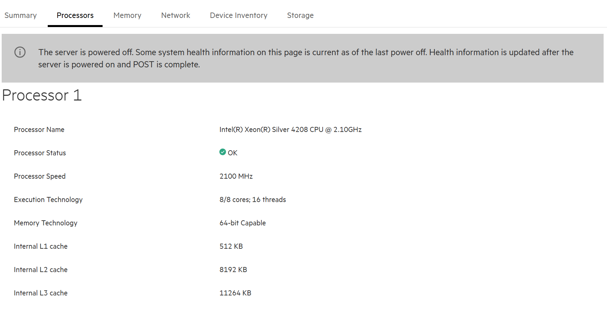
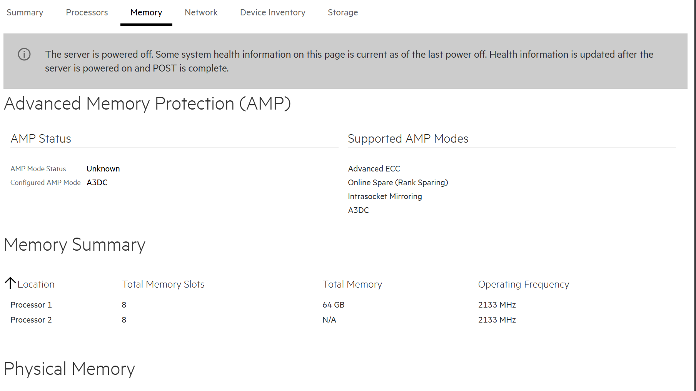

Natürlich! Hier sind die Antworten auf die Fragen rund um Remote Server Management Lösungen – stichwortartig und praxisnah:

---

### **Was sind iLO, DRAC und IPMI?**
- **iLO (Integrated Lights-Out)** → Remote Management von HP/HPE-Servern  
- **DRAC (Dell Remote Access Controller)** → Remote Management von Dell-Servern  
- **IPMI (Intelligent Platform Management Interface)** → Standardisierte Schnittstelle für Remote-Verwaltung (herstellerübergreifend)  
- Alle drei ermöglichen **Server-Fernzugriff auf Hardware-Ebene**, unabhängig vom Betriebssystem

---

### **Wozu braucht man Remote Server Management Lösungen?**
- **Zugriff auf den Server auch bei OS-Ausfall**  
- **Fernstart, -neustart oder -herunterfahren**  
- **Hardware-Monitoring (z. B. Temperatur, Lüfter, Fehler)**  
- **Firmware-Updates aus der Ferne**  
- Zugriff auf **virtuelle Konsole** (Tastatur/Monitor/Maus)  
- **Installation über ISO-Image aus der Ferne möglich**  
- Ideal für Rechenzentren oder Serverräume ohne direkten Zugang

---

### **Wie viele und welche Prozessoren sind in Ihrem Server verbaut?**
- Antwort direkt im iLO / DRAC / IPMI Menü unter **"System Information"** oder **"Processor Information"**  

---

### **Wie viel Memory steht zur Verfügung?**
- Ebenfalls sichtbar unter **"System Information"** → **"Memory"**  

---

### **Wie können Sie den Server neustarten?**
- Über die **Remote-Konsole**: Soft Reboot im Betriebssystem  
- Über das Management-Interface (iLO, DRAC, IPMI):  
  - Menüpunkt **"Power Management"**  
  - Option: **Restart Server** oder **Cold Boot** (hartes Reset)  

---

### **Wie können Sie den Server von einem ISO-Image starten?**
- Im Management-Interface:  
  - Menüpunkt: **Virtual Media / Remote Media / Media Redirection**  
  - ISO-Image vom lokalen PC mounten  
  - Boot-Reihenfolge auf **"Virtual CD/DVD"** setzen  
  - Neustarten → Server bootet von ISO  

---

### **Wie können Sie auf Tastatur, Bildschirm und Maus zugreifen?**
- Über **Remote-Konsole** im Management-Interface  
  - Wird oft als **"KVM-Konsole"**, "Launch Console" oder "Remote Console" bezeichnet  
  - Funktioniert wie direkter Zugriff – unabhängig vom installierten OS  

---

### **Was bedeutet die Abkürzung iLO?**
- **iLO = Integrated Lights-Out**  
- Proprietäre Remote Management-Lösung von **Hewlett Packard Enterprise (HPE)**  
